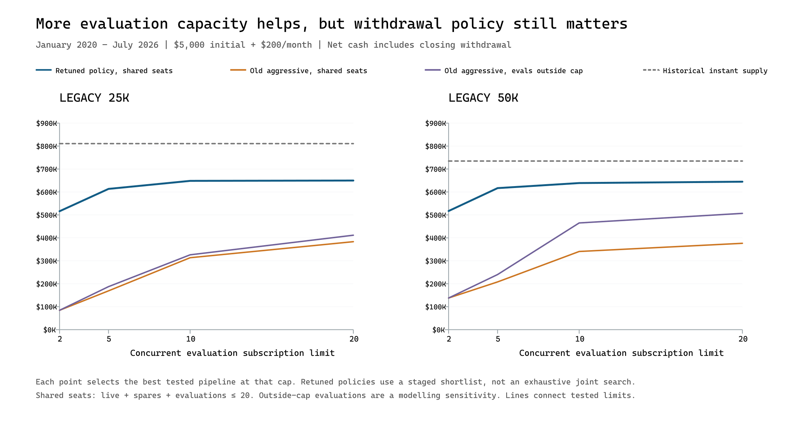

# What expanded evaluation capacity changed

6,188 unique simulations, 16 reproduced historical controls. January 2020–July 2026; $5,000 initial + $200/month. Dollar figures are net of evaluation and activation fees, and exclude owner contributions. Main results retain the shared 20-seat cap.

The earlier 57/44 funded-account counts were outcomes of the winning withdrawal policies, not production ceilings. The original five-evaluation pipeline already supplied many more accounts under aggressive withdrawals. The relevant question is whether expanded supply makes that higher turnover timely and profitable enough to win.

## Does the old aggressive policy recover?

| Product | Historical instant supply | Original evaluation pipeline | Best tested expanded shared-seat pipeline | Best tested evaluations-outside-cap sensitivity |
|---|---:|---:|---:|---:|
| legacy_25k | $810,670 (674 accounts) | $125,539 (204 accounts) | $383,378 (304 accounts) | $411,552 (431 accounts) |
| legacy_50k | $734,754 (370 accounts) | $191,780 (155 accounts) | $376,271 (207 accounts) | $506,741 (264 accounts) |

The withdrawal policy is held fixed within each product. Expanded-pipeline columns select the best tested pipeline for that policy.

- legacy_25k, shared seats: 20 subscriptions; 1 per 1d; 2 spares; persistent. Evaluations outside cap: 20 subscriptions; 1 per 1d; 10 spares; persistent.
- legacy_50k, shared seats: 20 subscriptions; 1 per 1d; 5 spares; day-only. Evaluations outside cap: 20 subscriptions; 1 per 1d; 10 spares; day-only.

## Does the earlier $6,000–$7,000 daily reserve still appear?

| Product | Best tested daily-maximum cushion | Ongoing | Closing | Total | Funded accounts |
|---|---:|---:|---:|---:|---:|
| legacy_25k | $6,800 | $530,657 | $99,264 | $629,920 | 56 |
| legacy_50k | $6,800 | $543,539 | $98,886 | $642,424 | 42 |

These are the best tested **daily maximum** candidates, not the winners across all withdrawal families. This supports the earlier reserve region under that particular withdrawal policy, not a universal reserve amount.

## What retuning selected

| Product / score | Pipeline | Withdrawal | Cushion above floor | Ongoing | Closing | Total | Funded / alive |
|---|---|---|---:|---:|---:|---:|---:|
| legacy_25k / total | 20 subscriptions; batch; 10 spares; persistent | minimum / calendar_month | $2,800 | $466,369 | $183,425 | $649,794 | 52 / 20 |
| legacy_25k / ongoing | 10 subscriptions; batch; 10 spares; persistent | minimum / daily | $3,900 | $597,317 | $0 | $597,317 | 76 / 19 |
| legacy_50k / total | 20 subscriptions; batch; 10 spares; persistent | minimum / calendar_month | $2,800 | $461,445 | $183,318 | $644,763 | 39 / 20 |
| legacy_50k / ongoing | 20 subscriptions; 1 per 1d; 2 spares; persistent | minimum / daily | $3,700 | $582,835 | $0 | $582,835 | 69 / 12 |

Cushion means profit above the frozen floor, not nominal account balance. The earlier 25K $31,900 threshold was a $6,800 cushion. It is a withdrawal threshold, not a target equity balance: minimum monthly withdrawals can let balances accumulate well above it. A smaller threshold under that policy is not the same as keeping a smaller actual cushion under daily maximum withdrawals. Funded-account counts are outcomes of each policy, not quantities the optimizer directly chose.

- legacy_25k / total: tested cushions $2,800, $2,900, $3,000, $3,100, $3,200, $3,300, $3,400 are within $1 of the selected score at this same pipeline and withdrawal family. Do not interpret cent-level rankings as a unique optimum.
- legacy_50k / total: tested cushions $2,800, $2,900, $3,000 are within $1 of the selected score at this same pipeline and withdrawal family. Do not interpret cent-level rankings as a unique optimum.

## Replacement service of the selected total winners

| Product / seats | Next-check service | Deaths / unresolved | Completed wait median / p95 days | Unfilled account-days | Average live | Zero-live days | Cash-blocked days |
|---|---:|---:|---:|---:|---:|---:|---:|
| legacy_25k / shared | 68.8% | 32 / 0 | 0.47 / 126.04 | 951 | 16.97 | 35.67 | 0 |
| legacy_25k / evals outside | 68.4% | 38 / 0 | 0.47 / 48.04 | 558 | 17.14 | 35.67 | 0 |
| legacy_50k / shared | 42.1% | 19 / 0 | 93.24 / 189.2 | 1,282 | 16.8 | 60.67 | 0 |
| legacy_50k / evals outside | 4.5% | 22 / 0 | 35.49 / 123.35 | 830 | 16.82 | 60.67 | 51 |

Completed-wait percentiles exclude unresolved replacements. Unfilled account-days includes every death’s wait until replacement or the horizon. Daily-state occupancy is sampled at decision boundaries; zero-live days includes startup.

## Matched changes at frozen withdrawal settings

These comparisons use the full screening matrix only. Each pair keeps product, withdrawal policy, seat mode, and all other pipeline settings fixed. Medians and win shares describe this grid, not probabilities of future improvement.

| Product | Seat mode | Change | Matched pairs | Median total change | Share improved |
|---|---|---|---:|---:|---:|
| legacy_25k | shared | persist missed demand | 144 | $6,260 | 62% |
| legacy_25k | shared | batch → one/day | 96 | $66 | 50% |
| legacy_25k | shared | batch → one/week | 96 | $-5,986 | 36% |
| legacy_25k | shared | 0 → 5 spares | 72 | $9,304 | 57% |
| legacy_25k | shared | 5 → 10 spares | 72 | $-79 | 32% |
| legacy_25k | shared | 5 → 10 subscriptions | 72 | $20,854 | 79% |
| legacy_25k | shared | 10 → 20 subscriptions | 72 | $33 | 50% |
| legacy_25k | evals outside | persist missed demand | 144 | $4,832 | 58% |
| legacy_25k | evals outside | batch → one/day | 96 | $0 | 49% |
| legacy_25k | evals outside | batch → one/week | 96 | $-6,839 | 33% |
| legacy_25k | evals outside | 0 → 5 spares | 72 | $15,337 | 61% |
| legacy_25k | evals outside | 5 → 10 spares | 72 | $-494 | 38% |
| legacy_25k | evals outside | 5 → 10 subscriptions | 72 | $22,086 | 79% |
| legacy_25k | evals outside | 10 → 20 subscriptions | 72 | $170 | 54% |
| legacy_50k | shared | persist missed demand | 144 | $-5,174 | 44% |
| legacy_50k | shared | batch → one/day | 96 | $5,433 | 62% |
| legacy_50k | shared | batch → one/week | 96 | $4,478 | 62% |
| legacy_50k | shared | 0 → 5 spares | 72 | $25,599 | 69% |
| legacy_50k | shared | 5 → 10 spares | 72 | $-1,105 | 22% |
| legacy_50k | shared | 5 → 10 subscriptions | 72 | $32,267 | 83% |
| legacy_50k | shared | 10 → 20 subscriptions | 72 | $5,855 | 67% |
| legacy_50k | evals outside | persist missed demand | 144 | $-2,006 | 49% |
| legacy_50k | evals outside | batch → one/day | 96 | $3,880 | 59% |
| legacy_50k | evals outside | batch → one/week | 96 | $3,591 | 58% |
| legacy_50k | evals outside | 0 → 5 spares | 72 | $60,107 | 79% |
| legacy_50k | evals outside | 5 → 10 spares | 72 | $-692 | 38% |
| legacy_50k | evals outside | 5 → 10 subscriptions | 72 | $32,067 | 82% |
| legacy_50k | evals outside | 10 → 20 subscriptions | 72 | $4,613 | 64% |

## Did any tested aggressive pipeline reach 95% next-check service?

- legacy_25k, shared seats: no tested candidate reached 95%.
- legacy_25k, evaluations outside the cap: no tested candidate reached 95%.
- legacy_50k, shared seats: no tested candidate reached 95%.
- legacy_50k, evaluations outside the cap: no tested candidate reached 95%.

This is realized service against each policy’s own deaths. Starvation changes which accounts exist and therefore which deaths occur; it is not a replay of a fixed external replacement-demand stream or a forecast of 95% reliability.

## Smaller-budget checks

Selected shared-seat winners were replayed without retuning at the other three budgets. The following are replays of the **total-score** winners, not new budget-specific optima.

| Product | $1,000 + $0/month | $1,000 + $200/month | $5,000 + $0/month |
|---|---:|---:|---:|
| legacy_25k | $-983 (1 funded) | $564,127 (75 funded) | $644,464 (53 funded) |
| legacy_50k | $-1,000 (0 funded) | $577,535 (56 funded) | $571,031 (55 funded) |

Both selected total-winner pipelines run out of usable funding at $1,000 with no top-ups. This does not mean that budget cannot work under another policy: the separate 50K ongoing-winner replay remains profitable. The full budget table is in REPORT.generated.md and budget_sensitivity.csv.

## Limits and reproducibility

The pipeline search screens three historical anchors before retuning a matched shortlist. It can miss a pipeline that needs an entirely different withdrawal policy to perform well. The same tape and starting date are used throughout. Different budgets are sensitivity replays, not independent samples. Increasing concurrency need not improve profit: it changes cohort timing, fees and the seats available to funded accounts. No constant-capacity, independent-pass or monotone-profit assumption is warranted.

See [full generated report](REPORT.generated.md), [capacity table](frontier.csv), [screening rows](screening.csv), [all settings](all_settings.csv), [audit](AUDIT.json), and [run contract](contract.json). Rebuild this note with `venv/Scripts/python.exe scripts/explain_legacy_pipeline_capacity.py`.
