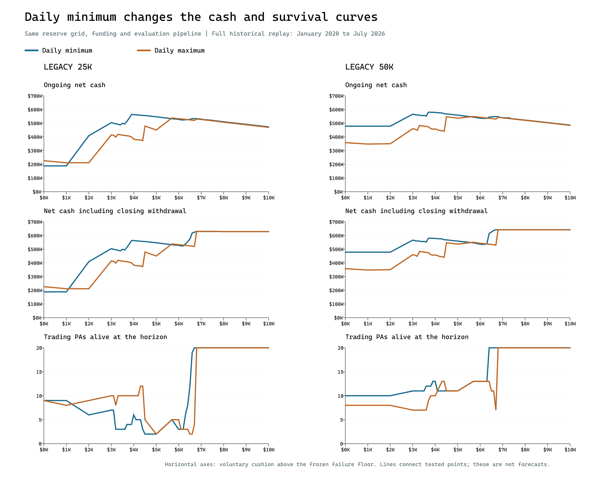

# Daily minimum versus maximum: matched reserve frontier

Completed 1,280 simulations, equally split between daily minimum and maximum withdrawals, on identical reserve grids and eight historical windows. Product-specific pipelines and owner funding are frozen to the prior maximum-frontier settings.

The main finding is two different reserve regions. Daily minimum has a broad full-history ongoing-cash plateau around $4,000, but accounts still die there and the book ends partly empty. Preserving established accounts instead requires roughly $6,700–$7,000 in the windows that include the March 2026 losses. Minimum does preserve different account balances, but it does not remove the shared loss exposure or consistently lower the survival boundary.

## Full-history findings

| Product | Daily request | Best tested ongoing reserve | Ongoing net | PAs alive at that reserve | All deaths | Tested aged-PA survival boundary |
| --- | --- | --- | --- | --- | --- | --- |
| legacy_25k | minimum | $4,000.00 | $563,891.00 | 6 | 65 | $6,800.00 |
| legacy_25k | maximum | $5,700.00 | $538,435.18 | 5 | 63 | $6,800.00 |
| legacy_50k | minimum | $3,700.00 | $580,680.00 | 12 | 58 | $6,700.00 |
| legacy_50k | maximum | $5,700.00 | $549,134.58 | 13 | 48 | $6,800.00 |

For legacy_25k, the best tested minimum-policy ongoing cash exceeds the best tested maximum-policy ongoing cash by $25,455.82. Their winning reserves and survival outcomes differ; this is a comparison of the best settings on the common grid, not a same-reserve effect.

For legacy_50k, the best tested minimum-policy ongoing cash exceeds the best tested maximum-policy ongoing cash by $31,545.42. Their winning reserves and survival outcomes differ; this is a comparison of the best settings on the common grid, not a same-reserve effect.

The aged-PA boundary is the lowest tested reserve from which that reserve and all higher tested reserves have zero deaths of accounts at least 365 days old, with positive exposure of such accounts. It is not a no-failure boundary for new PAs, which must first earn their cushion. A missing value means the tested grid does not establish that condition.

These pipelines differ from some winners in the broader pipeline search. In particular, the old 25K daily-minimum winner used batched starts, concurrency 10 and a spare target of 10. Here 25K keeps the maximum study’s seven-day start spacing, concurrency 20 and spare target 2. The old $597,317 result should not be treated as a control for this different pipeline.

## Fixed-reserve comparisons

### legacy_25k

| Reserve above floor | Daily rule | Ongoing net | Closing receipt | Total net | PAs alive | All deaths | Aged-PA deaths |
| --- | --- | --- | --- | --- | --- | --- | --- |
| $3,700.00 | maximum | $408,916.65 | $0.00 | $408,916.65 | 10 | 138 | 21 |
| $3,700.00 | minimum | $514,530.00 | $0.00 | $514,530.00 | 4 | 86 | 20 |
| $3,900.00 | maximum | $400,331.55 | $0.00 | $400,331.55 | 10 | 138 | 21 |
| $3,900.00 | minimum | $562,968.00 | $0.00 | $562,968.00 | 4 | 66 | 20 |
| $4,000.00 | maximum | $384,608.85 | $0.00 | $384,608.85 | 10 | 138 | 21 |
| $4,000.00 | minimum | $563,891.00 | $0.00 | $563,891.00 | 6 | 65 | 20 |
| $5,700.00 | maximum | $538,435.18 | $0.00 | $538,435.18 | 5 | 63 | 20 |
| $5,700.00 | minimum | $532,814.00 | $0.00 | $532,814.00 | 5 | 63 | 20 |
| $6,000.00 | maximum | $532,975.08 | $0.00 | $532,975.08 | 5 | 63 | 20 |
| $6,000.00 | minimum | $528,239.00 | $0.00 | $528,239.00 | 3 | 62 | 20 |
| $6,500.00 | maximum | $524,276.12 | $0.00 | $524,276.12 | 2 | 62 | 20 |
| $6,500.00 | minimum | $528,165.00 | $46,536.91 | $574,701.91 | 12 | 52 | 10 |
| $6,600.00 | maximum | $522,456.12 | $0.00 | $522,456.12 | 2 | 62 | 20 |
| $6,600.00 | minimum | $533,150.00 | $85,421.11 | $618,571.11 | 19 | 40 | 2 |
| $6,700.00 | maximum | $520,426.12 | $0.00 | $520,426.12 | 4 | 63 | 20 |
| $6,700.00 | minimum | $533,857.00 | $90,351.89 | $624,208.89 | 20 | 38 | 1 |
| $6,800.00 | maximum | $530,656.82 | $99,263.62 | $629,920.44 | 20 | 36 | 0 |
| $6,800.00 | minimum | $533,273.00 | $96,647.29 | $629,920.29 | 20 | 36 | 0 |
| $7,100.00 | maximum | $525,196.80 | $104,723.62 | $629,920.42 | 20 | 36 | 0 |
| $7,100.00 | minimum | $526,423.00 | $103,497.29 | $629,920.29 | 20 | 36 | 0 |
| $7,500.00 | maximum | $517,916.79 | $112,003.62 | $629,920.41 | 20 | 36 | 0 |
| $7,500.00 | minimum | $521,023.00 | $108,897.29 | $629,920.29 | 20 | 36 | 0 |

### legacy_50k

| Reserve above floor | Daily rule | Ongoing net | Closing receipt | Total net | PAs alive | All deaths | Aged-PA deaths |
| --- | --- | --- | --- | --- | --- | --- | --- |
| $3,700.00 | maximum | $474,600.85 | $0.00 | $474,600.85 | 9 | 116 | 22 |
| $3,700.00 | minimum | $580,680.00 | $0.00 | $580,680.00 | 12 | 58 | 20 |
| $3,900.00 | maximum | $456,601.15 | $0.00 | $456,601.15 | 10 | 111 | 22 |
| $3,900.00 | minimum | $579,730.00 | $0.00 | $579,730.00 | 13 | 51 | 20 |
| $4,000.00 | maximum | $458,282.65 | $0.00 | $458,282.65 | 10 | 111 | 22 |
| $4,000.00 | minimum | $579,160.00 | $0.00 | $579,160.00 | 13 | 49 | 20 |
| $5,700.00 | maximum | $549,134.58 | $1,898.95 | $551,033.53 | 13 | 48 | 20 |
| $5,700.00 | minimum | $544,795.00 | $1,902.10 | $546,697.10 | 13 | 48 | 20 |
| $6,000.00 | maximum | $543,231.40 | $0.00 | $543,231.40 | 13 | 48 | 20 |
| $6,000.00 | minimum | $536,685.00 | $0.00 | $536,685.00 | 13 | 48 | 20 |
| $6,500.00 | maximum | $534,441.40 | $0.00 | $534,441.40 | 11 | 48 | 20 |
| $6,500.00 | minimum | $546,625.00 | $78,836.20 | $625,461.20 | 20 | 25 | 3 |
| $6,600.00 | maximum | $532,641.40 | $0.00 | $532,641.40 | 11 | 48 | 20 |
| $6,600.00 | minimum | $547,855.00 | $88,437.29 | $636,292.29 | 20 | 23 | 1 |
| $6,700.00 | maximum | $529,946.40 | $0.00 | $529,946.40 | 7 | 55 | 20 |
| $6,700.00 | minimum | $548,470.00 | $93,294.81 | $641,764.81 | 20 | 22 | 0 |
| $6,800.00 | maximum | $542,879.40 | $98,885.60 | $641,765.00 | 20 | 22 | 0 |
| $6,800.00 | minimum | $548,020.00 | $93,744.81 | $641,764.81 | 20 | 22 | 0 |
| $7,100.00 | maximum | $537,479.39 | $104,285.60 | $641,764.99 | 20 | 22 | 0 |
| $7,100.00 | minimum | $539,920.00 | $101,844.81 | $641,764.81 | 20 | 22 | 0 |
| $7,500.00 | maximum | $530,279.40 | $111,485.60 | $641,765.00 | 20 | 22 | 0 |
| $7,500.00 | minimum | $531,820.00 | $109,944.81 | $641,764.81 | 20 | 22 | 0 |

Net cash is after payout splits and all evaluation/activation spending. It excludes owner contributions. Ongoing net subtracts all costs from operating receipts; total adds the final permitted withdrawal. The same trajectory produces both scores. End-of-run profit equity is a separate CSV column and should not be confused with the permitted closing receipt.

## How wide is the cash plateau?

| Product | Rule | Tested reserves within 1% of best ongoing cash |
| --- | --- | --- |
| legacy_25k | minimum | $3,900, $4,000, $4,100, $4,200, $4,300 |
| legacy_25k | maximum | $5,700 |
| legacy_50k | minimum | $3,700, $3,800, $3,900, $4,000, $4,100, $4,200, $4,300 |
| legacy_50k | maximum | $4,500, $5,700 |

These are discrete tested values, not continuous intervals or confidence bands. A near-best cash reserve can still lose the whole established book. The most profitable reserve is not necessarily the reserve that best preserves earning capacity.

## Balance dispersion and the March event

| Product | Reserve | Rule | Live before March 30 trade | Different profit balances | Deaths on March 30 | Mean spread among frozen-floor PAs | Time all frozen-floor balances identical |
| --- | --- | --- | --- | --- | --- | --- | --- |
| legacy_25k | $6,500.00 | maximum | 0 | 0 | 0 | $347.56 | 50.5% |
| legacy_25k | $6,500.00 | minimum | 12 | 7 | 2 | $452.23 | 0.0% |
| legacy_25k | $6,700.00 | maximum | 20 | 1 | 20 | $388.21 | 35.5% |
| legacy_25k | $6,700.00 | minimum | 20 | 12 | 1 | $445.68 | 0.0% |
| legacy_25k | $6,800.00 | maximum | 20 | 1 | 0 | $364.57 | 40.3% |
| legacy_25k | $6,800.00 | minimum | 20 | 12 | 0 | $443.46 | 0.0% |
| legacy_50k | $6,500.00 | maximum | 0 | 0 | 0 | $131.16 | 44.7% |
| legacy_50k | $6,500.00 | minimum | 17 | 5 | 0 | $189.78 | 0.0% |
| legacy_50k | $6,700.00 | maximum | 20 | 1 | 20 | $165.66 | 44.8% |
| legacy_50k | $6,700.00 | minimum | 20 | 8 | 0 | $168.80 | 0.0% |
| legacy_50k | $6,800.00 | maximum | 20 | 1 | 0 | $137.21 | 48.9% |
| legacy_50k | $6,800.00 | minimum | 20 | 8 | 0 | $177.11 | 0.0% |

Minimum asks for $500 when eligible; maximum asks for all permitted excess above the target. Daily checks do not guarantee daily payouts. Fixed-size withdrawals can preserve residual balance differences while maximum withdrawals can reset accounts to the same target. Minimum also retains more money on some paths, so the fixed-reserve comparison measures both effects together.

Spread is the cross-account population standard deviation, averaged over event time. The frozen-floor group contains only live PAs whose failure floor has stopped trailing, reducing the influence of brand-new accounts. Periods with fewer than two qualifying PAs are excluded from the spread and synchronization denominators, and their exposure days are reported. The age-based survival measure and frozen-floor dispersion group are deliberately different concepts. All PAs still share the same trades; different balances do not create independent trading returns.

The March 30 final trade’s adverse excursion was $81.50. The previously measured $6,780.10–$6,780.11 cliff reflects earlier accumulated losses plus that last excursion, not a single huge trade. Zero deaths on March 30 can also mean the book died earlier; read the pre-trade live count and lifetime death measures together.

## Comparison at similar actual retained capital

| Product | Minimum reserve | Nearest maximum reserve | Per-PA capital gap % | Book capital gap % | Both within 5% | Minimum ongoing | Maximum ongoing | Minimum survivors | Maximum survivors |
| --- | --- | --- | --- | --- | --- | --- | --- | --- | --- |
| legacy_25k | $3,700.00 | $5,000.00 | 7.349 | 13.316 | no | $514,530.00 | $450,534.00 | 4 | 2 |
| legacy_25k | $3,900.00 | $5,700.00 | 11.652 | 12.714 | no | $562,968.00 | $538,435.18 | 4 | 5 |
| legacy_25k | $4,000.00 | $5,700.00 | 8.538 | 8.888 | no | $563,891.00 | $538,435.18 | 6 | 5 |
| legacy_25k | $6,000.00 | $6,900.00 | 4.212 | 0.74 | yes | $528,239.00 | $528,836.82 | 3 | 20 |
| legacy_25k | $6,500.00 | $7,500.00 | 2.516 | 0.284 | yes | $528,165.00 | $517,916.79 | 12 | 20 |
| legacy_25k | $6,700.00 | $8,000.00 | 2.136 | 1.889 | yes | $533,857.00 | $507,450.23 | 20 | 20 |
| legacy_25k | $6,800.00 | $8,000.00 | 0.917 | 0.657 | yes | $533,273.00 | $507,450.23 | 20 | 20 |
| legacy_25k | $7,100.00 | $8,000.00 | 3.091 | 3.341 | yes | $526,423.00 | $507,450.23 | 20 | 20 |
| legacy_25k | $7,500.00 | $9,000.00 | 3.406 | 3.139 | yes | $521,023.00 | $489,050.13 | 20 | 20 |
| legacy_50k | $3,700.00 | $5,000.00 | 1.796 | 2.277 | yes | $580,680.00 | $537,260.48 | 12 | 11 |
| legacy_50k | $3,900.00 | $5,000.00 | 6.993 | 8.011 | no | $579,730.00 | $537,260.48 | 13 | 11 |
| legacy_50k | $4,000.00 | $5,000.00 | 9.095 | 10.095 | no | $579,160.00 | $537,260.48 | 13 | 11 |
| legacy_50k | $6,000.00 | $7,000.00 | 1.803 | 0.455 | yes | $536,685.00 | $539,279.39 | 13 | 20 |
| legacy_50k | $6,500.00 | $7,500.00 | 1.956 | 1.919 | yes | $546,625.00 | $530,279.40 | 20 | 20 |
| legacy_50k | $6,700.00 | $7,500.00 | 3.61 | 3.61 | yes | $548,470.00 | $530,279.40 | 20 | 20 |
| legacy_50k | $6,800.00 | $8,000.00 | 1.768 | 1.768 | yes | $548,020.00 | $521,279.40 | 20 | 20 |
| legacy_50k | $7,100.00 | $8,000.00 | 2.182 | 2.182 | yes | $539,920.00 | $521,279.40 | 20 | 20 |
| legacy_50k | $7,500.00 | $9,000.00 | 3.877 | 3.877 | yes | $531,820.00 | $503,279.22 | 20 | 20 |

For every minimum setting with positive average retained profit, select the maximum setting in the same product/window minimizing the sum of relative differences in average book profit and average profit per live PA. A pair is flagged comparable only when both differences are at most 5%, relative to minimum. No interpolation or invented reserve is used.

This is an outcome-based descriptive match, not a controlled causal experiment. Similar lifetime average capital does not guarantee the same capital immediately before a shock, the same account ages, or the same payout history. It can show whether a difference persists at roughly similar retention, but cannot assign a percentage of the benefit to desynchronization.

For legacy_25k, minimum at $6,800 matches maximum at $8,000.00 within 0.92% per PA and 0.66% for the book. Minimum delivers $25,822.77 more ongoing net cash; both finish with 20 live PAs. This supports examining payout timing and balance differences further, while retaining the limitations of average-capital matching.

For legacy_50k, minimum at $6,800 matches maximum at $8,000.00 within 1.77% per PA and 1.77% for the book. Minimum delivers $26,740.60 more ongoing net cash; both finish with 20 live PAs. This supports examining payout timing and balance differences further, while retaining the limitations of average-capital matching.

## Replacement demand and retained profit

| Product | Reserve | Rule | Eval subscriptions | Completed median wait, days | Completed p95 wait, days | Unfilled replacements at end | Unfilled replacement PA-days | Mean retained profit / live PA |
| --- | --- | --- | --- | --- | --- | --- | --- | --- |
| legacy_25k | $3,900.00 | maximum | 157 | 81.62 | 167.04 | 10 | 11553.95 | $2,633.17 |
| legacy_25k | $3,900.00 | minimum | 79 | 34.6 | 124.02 | 16 | 3749.82 | $3,866.19 |
| legacy_25k | $6,700.00 | maximum | 73 | 31.75 | 124.02 | 16 | 3349.77 | $5,095.60 |
| legacy_25k | $6,700.00 | minimum | 60 | 26.47 | 126.04 | 0 | 1544.54 | $5,941.90 |
| legacy_25k | $6,800.00 | maximum | 58 | 27.48 | 126.04 | 0 | 1538.35 | $5,167.52 |
| legacy_25k | $6,800.00 | minimum | 58 | 27.48 | 126.04 | 0 | 1538.35 | $6,013.67 |
| legacy_25k | $7,100.00 | maximum | 58 | 27.48 | 126.04 | 0 | 1538.35 | $5,401.77 |
| legacy_25k | $7,100.00 | minimum | 58 | 27.48 | 126.04 | 0 | 1538.35 | $6,262.41 |
| legacy_50k | $3,900.00 | maximum | 133 | 44.12 | 123.35 | 10 | 5422.71 | $2,535.47 |
| legacy_50k | $3,900.00 | minimum | 73 | 35.49 | 121.35 | 7 | 1988.93 | $3,765.67 |
| legacy_50k | $6,700.00 | maximum | 77 | 35.49 | 121.35 | 13 | 2103.25 | $4,956.38 |
| legacy_50k | $6,700.00 | minimum | 44 | 35.49 | 123.35 | 0 | 830.17 | $5,736.98 |
| legacy_50k | $6,800.00 | maximum | 44 | 35.49 | 123.35 | 0 | 830.17 | $5,055.40 |
| legacy_50k | $6,800.00 | minimum | 44 | 35.49 | 123.35 | 0 | 830.17 | $5,845.11 |
| legacy_50k | $7,100.00 | maximum | 44 | 35.49 | 123.35 | 0 | 830.17 | $5,270.35 |
| legacy_50k | $7,100.00 | minimum | 44 | 35.49 | 123.35 | 0 | 830.17 | $6,081.20 |

Median and p95 use completed replacement waits only. Unresolved counts and accumulated replacement PA-days include censored waits through the horizon. Unused capacity during startup is reported separately from unmet replacement demand. Actual retained profit integrates settled equity between trade, payout and decision events. It excludes nominal $25K/$50K balances and is not a reconstructed intratrade marked-equity path.

## Historical window sensitivity

For legacy_25k, minimum wins on best tested ongoing cash in 5 of 8 windows. Maximum wins in start_2024, two_years_2020, two_years_2024. These are comparisons after separately selecting each mechanism's best reserve within each window, not the performance of one fixed reserve across all windows.

For legacy_50k, minimum wins on best tested ongoing cash in 4 of 8 windows. Maximum wins in start_2024, two_years_2020, two_years_2022, two_years_2024. These are comparisons after separately selecting each mechanism's best reserve within each window, not the performance of one fixed reserve across all windows.

In the January 2023 cold start, both products need $7,000 under minimum versus $6,800 under maximum to meet the aged-PA survival criterion. Consequently, the full-history 50K $6,700 minimum-policy boundary is not stable across starting dates.

| Product | Window | Daily rule | Best ongoing reserve | Best ongoing net | Aged-PA survival boundary | All deaths at boundary | Aged PA-days at boundary |
| --- | --- | --- | --- | --- | --- | --- | --- |
| legacy_25k | full | minimum | $4,000.00 | $563,891.00 | $6,800.00 | 36 | 28538.93 |
| legacy_25k | full | maximum | $5,700.00 | $538,435.18 | $6,800.00 | 36 | 28538.93 |
| legacy_25k | start_2021 | minimum | $4,000.00 | $508,689.00 | $6,800.00 | 25 | 23770.93 |
| legacy_25k | start_2021 | maximum | $5,700.00 | $481,300.61 | $6,800.00 | 25 | 23770.93 |
| legacy_25k | start_2022 | minimum | $3,000.00 | $429,817.00 | $6,800.00 | 23 | 16295.93 |
| legacy_25k | start_2022 | maximum | $4,500.00 | $403,712.32 | $6,800.00 | 23 | 16295.93 |
| legacy_25k | start_2023 | minimum | $3,300.00 | $326,358.00 | $7,000.00 | 14 | 10950.93 |
| legacy_25k | start_2023 | maximum | $5,000.00 | $303,397.70 | $6,800.00 | 14 | 10950.93 |
| legacy_25k | start_2024 | minimum | $4,100.00 | $124,252.00 | $7,000.00 | 26 | 4717.44 |
| legacy_25k | start_2024 | maximum | $5,000.00 | $128,922.75 | $7,100.00 | 26 | 4717.44 |
| legacy_25k | two_years_2020 | minimum | $3,000.00 | $35,655.00 | n/a | n/a | n/a |
| legacy_25k | two_years_2020 | maximum | $3,000.00 | $60,940.90 | n/a | n/a | n/a |
| legacy_25k | two_years_2022 | minimum | $0.00 | $87,952.00 | $3,000.00 | 16 | 1333.64 |
| legacy_25k | two_years_2022 | maximum | $0.00 | $82,993.30 | $3,300.00 | 16 | 1333.64 |
| legacy_25k | two_years_2024 | minimum | $5,000.00 | $29,575.00 | $7,000.00 | 32 | 1545.83 |
| legacy_25k | two_years_2024 | maximum | $5,000.00 | $36,023.20 | $7,100.00 | 32 | 1545.83 |
| legacy_50k | full | minimum | $3,700.00 | $580,680.00 | $6,700.00 | 22 | 30001.93 |
| legacy_50k | full | maximum | $5,700.00 | $549,134.58 | $6,800.00 | 22 | 30001.93 |
| legacy_50k | start_2021 | minimum | $3,700.00 | $529,165.00 | $6,800.00 | 11 | 25203.93 |
| legacy_50k | start_2021 | maximum | $4,500.00 | $506,817.83 | $6,800.00 | 11 | 25203.93 |
| legacy_50k | start_2022 | minimum | $3,000.00 | $415,205.00 | $6,800.00 | 8 | 15000.93 |
| legacy_50k | start_2022 | maximum | $4,500.00 | $390,535.32 | $6,800.00 | 8 | 15000.93 |
| legacy_50k | start_2023 | minimum | $0.00 | $330,350.00 | $7,000.00 | 3 | 10208.93 |
| legacy_50k | start_2023 | maximum | $5,000.00 | $298,097.20 | $6,800.00 | 3 | 10208.93 |
| legacy_50k | start_2024 | minimum | $4,500.00 | $135,385.00 | $7,000.00 | 17 | 4859.44 |
| legacy_50k | start_2024 | maximum | $5,000.00 | $139,075.55 | $6,800.00 | 17 | 4859.44 |
| legacy_50k | two_years_2020 | minimum | $3,000.00 | $50,155.00 | n/a | n/a | n/a |
| legacy_50k | two_years_2020 | maximum | $3,000.00 | $74,316.00 | n/a | n/a | n/a |
| legacy_50k | two_years_2022 | minimum | $0.00 | $64,570.00 | $3,000.00 | 2 | 863.84 |
| legacy_50k | two_years_2022 | maximum | $1,000.00 | $102,413.90 | $3,300.00 | 2 | 863.84 |
| legacy_50k | two_years_2024 | minimum | $5,000.00 | $44,985.00 | $7,000.00 | 28 | 1918.81 |
| legacy_50k | two_years_2024 | maximum | $2,000.00 | $60,353.15 | $6,800.00 | 28 | 1918.81 |

The full history runs January 2020–July 2026. Annual cold starts begin in 2021, 2022, 2023 and 2024 and end at the same July 2026 horizon. Three two-year windows start in July 2020, July 2022 and July 2024. Every window starts empty with fresh funding and no inherited account equity. No trade entering before the start or exiting beyond the end is imported.

These overlapping windows reuse the same history that informed earlier choices. They measure historical sensitivity, not independent validation or future survival probabilities. No new market paths or replacement-supply outages are generated in this frontier; those require a separate paired stress experiment.

The useful next comparison is a small, preselected stress set: minimum at $4,000 for cash extraction and around $7,000–$7,500 for established-account survival, with matched maximum controls. Apply the same replacement interruptions and adverse trade sequences to both mechanisms, and compare cash, book recovery and capital immediately before each shock. That would test whether the attractive lower-reserve cash result depends on favorable replacement timing. This frontier alone does not answer that counterfactual or establish a live trading reserve.

## Frozen assumptions and validation

Both products use $5,000 initial funding plus $200 per later month, persistent monthly growth demand, a 20-seat reservation limit, concurrency 20 and two activated spare PAs as the shelf target. New evaluations start at most every seven days for 25K and every day for 50K. Evaluations reserve future PA capacity and passed evaluations must activate at the next daily check or be forfeited. The study keeps the earlier Legacy fees, exposure, payout interpretation and trade-path convention. This is an operating model, not a reconstruction of all historical firm rules.

The common grid is $0–$10,000 in $1,000 steps, with $100 steps from $3,000–$4,500 and $6,000–$7,500, plus the earlier $5,700 maximum-policy winner. The grid has 40 reserves for each of two products, two mechanisms and eight windows. There is no pipeline retuning or post-result expansion of the grid.

All 1,280 runs reconcile economic and owner-cash identities and obey the seat cap. 416 maximum-policy rows reproduce every shared numerical field from the previous frontier. The matched March-review cases also reproduce their cash and survival results. 20 detailed replays match their frontier rows. 662 prior result files are unchanged; plain-language navigation guides may be refreshed separately.

Files: [all settings](frontier.csv), [same-reserve differences](matched_reserves.csv), [similar-capital comparisons](similar_capital.csv), [window summaries](window_summaries.csv), [complete study](study.json), [audit](AUDIT.json). The detailed run folders hold March traces, account deaths, replacement waits and daily pipeline states. Each has a START_HERE.txt guide.
