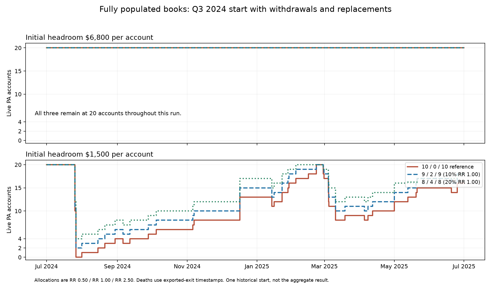

# A full book and a well-capitalized book are different things

The 624-case comparison separates initial account count from starting
headroom. **At $6,800 initial headroom per account, none of the tested
allocations loses a single account. At $1,500, even a fully populated
20-account book can fail completely.** The 10% RR 1.00 allocation prevents
one shared failure period in the thin-headroom control, but does not
consistently accelerate rebuilding.

RR is the strategy; numeric settings are r/r. Allocations below are ordered
RR 0.50 / RR 1.00 / RR 2.50. The fixed mixtures are 10/0/10, 9/2/9 and 8/4/8;
20-seat homogeneous controls at all three settings were also included.

## What was initialized

Every case begins with 20 already-owned PAs, flat, with identical balances
and a frozen $25,100 floor. The primary balance is $31,900 ($6,800 headroom);
the thin control is $26,600 ($1,500 headroom). Each PA trades one MNQ. There
are no invented prior trading days, payouts or withdrawal claims. Payout
eligibility accrues during the run under the inherited rulebook.

The primary book starts with **$138,000 of retained equity above nominal
starting balances**, versus **$32,000** for the thin control. This is an
explicit endowment, not newly earned trading profit. The study does not
claim those states are equally easy or cheap to build. All allocations
within each starting-state panel receive the same endowment.

The lower-headroom control also has a frozen floor. It is not a book of
fresh PAs whose floors have yet to trail. Original acquisition expenses are
treated as sunk; forward cash excludes buying the pre-owned inventory.

## No replacements or withdrawals: all 26 quarters

Accounts start together at every complete quarter from January 2020 through
June 2026. The initial cohort runs to quarter end without replenishment.

| Starting headroom | Allocation | Complete-loss quarters / 26 | Mean original survivors / 20 |
|---|---|---:|---:|
| $6,800 | 10/0/10 | 0 | 20.00 |
| $6,800 | 9/2/9 | 0 | 20.00 |
| $6,800 | 8/4/8 | 0 | 20.00 |
| $1,500 | 10/0/10 | 3 | 15.77 |
| $1,500 | 9/2/9 | 2 | 15.65 |
| $1,500 | 8/4/8 | 2 | 15.54 |

All three homogeneous controls also retain all 20 accounts in every
$6,800 quarter. Therefore the primary state cannot rank failure protection:
there are no failures to diversify, including in single-setting books.

In the $1,500 control, Q3 2024 finishes with **0, 2 and 4** surviving original
accounts respectively. Q2 2022 and Q2 2025 still defeat every component. The
10% and 20% allocations reduce the complete-loss count while slightly
increasing the average number of original accounts lost. Their average
failure fractions are 21.73% and 22.31%, versus 21.15% for the reference.

## Withdrawals and replacements enabled

All books retain the inherited daily-minimum withdrawal policy, with a
$6,800 reserve, $5,000 replacement cash plus $200/month, RR 1.00 evaluation
supply and the same shared 20-slot cap. The original PAs are pre-owned;
replacements must be earned and purchased through the normal pipeline and
start with fresh PA balances and trailing floors. Replacement assignments
fill the least populated group relative to its target weight, with fixed
RR 0.50-first ties. Actual replacement inventories are not forced to equal
the desired ratio by transferring or relabeling accounts.

All 26 starts have follow-up up to 12 months. The last three starts have
only 9, 6 and 3 months available. The following comparisons use the **23
complete twelve-month cohorts**; all 26 remain in the raw results, including
their unrecovered/censored status.

At $6,800 starting headroom, all allocations and homogeneous controls again
lose **zero accounts**, across all available follow-ups. They remain at 20
PAs and require no replacements. No recovery speed can be inferred from
cases that never suffer a loss. Mean forward receipts/net cash for the
three mixtures over complete 12-month cohorts are approximately $96,522,
$96,565 and $96,609. These close cash figures do not establish a survival
advantage for the middle component.

At $1,500 starting headroom:

| Allocation | Cases with any book wipeout / 23 | Mean empty days | Mean days below 5 PAs | Mean days below 10 PAs | Mean days below 20 PAs | Mean forward net cash |
|---|---:|---:|---:|---:|---:|---:|
| 10/0/10 | 3 | 0.57 | 11.19 | 22.71 | 115.05 | $15,162 |
| 9/2/9 | 2 | 0.34 | 8.52 | 26.61 | 123.89 | $15,471 |
| 8/4/8 | 2 | 0.34 | 5.05 | 28.68 | 125.93 | $15,872 |

The middle component reduces time at very low capacity and avoids one
wipeout. But the books spend **more** time below ten and twenty accounts
across the complete follow-ups. This is a change in the distribution of
capacity losses, not uniform improvement.

The reference has 13 cases with a capacity shortfall, with first recovery
observed in 9. Both middle-component books have 14 such cases; first recovery
is observed in 9 for 10% and 8 for 20%. Unrecovered cases are censored, not
assigned a zero-day recovery. Conditional recovery medians concern different
sets of cases and should not be treated as a paired speed comparison.

Mean replacement costs are $1,816, $1,855 and $1,824 respectively. No mixture
has a cash-limited purchase decision in the complete follow-ups under the
specified funding. This does not estimate the minimum cash requirement;
evaluation supply, timing and capacity remain part of rebuilding.

## What happened in the specifically protected Q3 2024 start?

| $1,500-headroom allocation | Minimum live PAs | Empty days | Days from first shortfall to first return to 20 | Live at twelve-month end |
|---|---:|---:|---:|---:|
| 10/0/10 | 0 | 5.29 | 211.15 | 16 |
| 9/2/9 | 2 | 0.00 | 211.15 | 18 |
| 8/4/8 | 4 | 0.00 | 193.15 | 18 |

The 10% component keeps two PAs trading throughout the initial collapse, but
the first return to 20 occurs at the same time as for the reference. The
20% component first returns to 20 eighteen days earlier. Later losses leave
all three below 20 at the horizon, so first recovery is not durable recovery.

## Interpretation

The prior finding that no book emptied after growing past nine accounts
was not evidence that a large account count itself confers safety. Starting
with twenty thin-headroom accounts still permits complete losses. Starting
with substantial retained headroom protects even homogeneous books in this
sample. **Getting to twenty seats and getting those seats to a resilient
balance state are separate milestones.**

The small middle component has a real, limited benefit in the thin control:
it preserves some earning capacity in Q3 2024. The tested $6,800 state provides
no evidence that it is necessary for survival, and the recovery comparison
does not establish it as a generally faster way to rebuild. Keep the reference
and 10% allocation distinguishable; the result does not select a universal
best mix or prove $6,800 safe in future data.

These are already examined, overlapping historical cohorts. All accounts
within a group begin identically. Their correlated losses remain; survivors
count available seats, not equal expected dollar earning power. Intratrade
death times remain bounded by entry/exit, with exported exits used for the
occupancy clock. Unclosed positions remain occupied and their future outcomes
are censored at each test horizon.

## Validation and reproducibility

- 624 cases complete: six allocations, 26 starts, two states and two phases.
- 3,120 original-account breach checks reproduce the prior fixed-floor
  results in the $1,500 hold control.
- 9,615,390 account/trade copies checked for assignment and position overlap.
- Seed equity is reconciled explicitly; no initial equity is counted as
  run trading profit. Cash, reserve and shared-capacity checks pass.
- Three targeted tests cover horizon censoring (including a blocked later
  entry), pre-owned inventory funding and replenishment of the small group.
- A separate audit reconstructs capacity durations, recovery and weighted
  assignments from account lifetimes across all 624 cases.
- The shared simulator source and previous sealed studies are unchanged.

[Design](../../../research/legacy_25k/MATURE_RR_BOOK.md) ·
[Every case](comparison.csv) · [All-state summaries](summary.csv) ·
[Complete twelve-month cases](complete_12m.csv) ·
[Run audit](audit.json) · [Independent audit](verification/audit.json)
