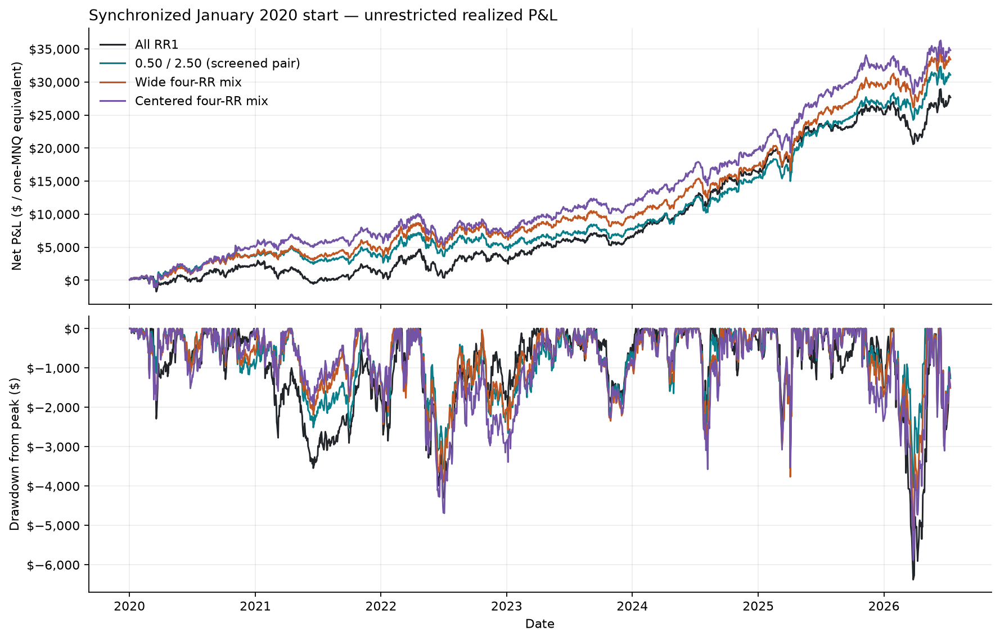
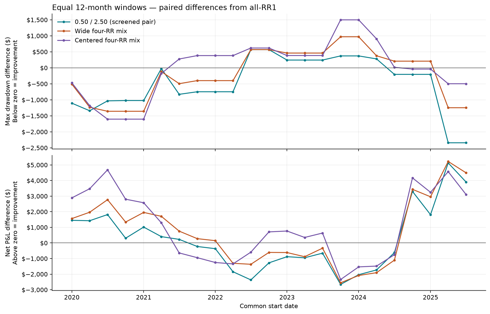
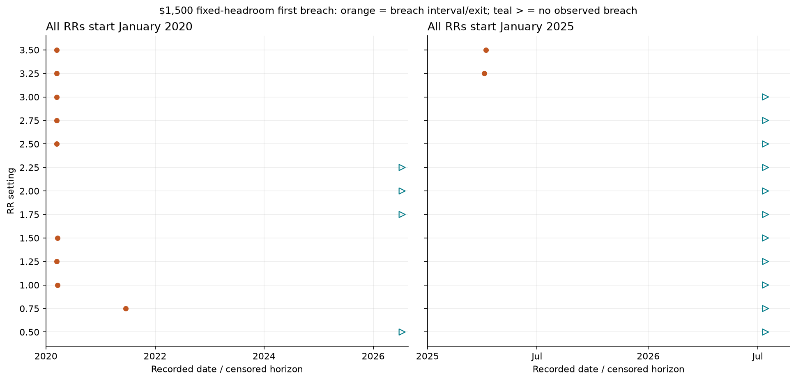

# Synchronized RR curves and failure markers

**A modest historical mixing benefit exists at matched nominal exposure. It does not remove common bad periods, and the strongest-looking mix is not consistently superior across windows.**

29 common-start cohorts; 13 RR variants; 97 portfolios; 2,813 curve comparisons. No withdrawals, purchases, replacements, caps, compounding or termination of analytical curves. Primary results use 23 overlapping twelve-month windows, with quarterly starts from January 2020 through July 2025.

Every displayed portfolio is an equal-weight average in one-MNQ-equivalent units. Adding another identical RR1 account leaves this normalized curve unchanged. Different variants still have different trade counts and holding times; exposure.csv records those differences. These are realized P&L paths, not synchronized open equity.

## 1. Does mixing improve the resulting curve?

Dollar figures are descriptive means of window outcomes, not annual forecasts. The lowest-drawdown pair below was identified on these same data and is an exploratory candidate.

| Portfolio | Mean net P&L | Mean maximum drawdown | Lower drawdown than RR1 | Lower than every constituent | Mean smoothing versus constituent-average drawdown |
|---|---:|---:|---:|---:|---:|
| rr_1.00 | $4,187 | $3,274 | 0/23 | 0/23 | $0 |
| rr_0.50 | $3,004 | $2,810 | 12/23 | 0/23 | $0 |
| rr_2.50 | $5,819 | $3,186 | 10/23 | 0/23 | $0 |
| pair_0.50_2.50 | $4,412 | $2,795 | 15/23 | 5/23 | $203 |
| pair_0.50_3.50 | $4,253 | $2,941 | 12/23 | 5/23 | $263 |
| wide4 | $4,875 | $3,072 | 12/23 | 0/23 | $211 |
| center4 | $5,246 | $3,275 | 10/23 | 1/23 | $143 |
| edge4 | $4,397 | $3,040 | 12/23 | 2/23 | $235 |
| without050 | $4,952 | $3,184 | 12/23 | 0/23 | $181 |
| grid5 | $4,754 | $3,133 | 12/23 | 4/23 | $221 |

The lowest mean-drawdown pair is **0.50/2.50**: 14.6% lower mean maximum drawdown than RR1, with 5.4% higher mean net P&L. Compare it with the single-RR controls before crediting all of that difference to diversification.

The constituent-average drawdown column separates some peak-offset smoothing from simply including a less volatile component. It is not equivalent to beating the safest component. The original wide4 never beats every constituent on maximum drawdown in these 23 windows.

### Chronological stability

Early = the twelve starts in 2020–2022; later = the eleven starts in 2023–July 2025. The windows overlap and both periods were already available to this research. This is not unseen validation.

| Mix | Earlier drawdown wins vs RR1 | Later drawdown wins vs RR1 | Earlier mean drawdown difference | Later mean drawdown difference |
|---|---:|---:|---:|---:|
| pair_0.50_2.50 | 10/12 | 5/11 | $-623 | $-323 |
| pair_0.50_1.75 | 10/12 | 5/11 | $-594 | $-168 |
| pair_1.00_2.50 | 10/12 | 5/11 | $-343 | $-13 |
| wide4 | 10/12 | 2/11 | $-541 | $166 |
| center4 | 6/12 | 4/11 | $-332 | $363 |

Lower-RR / middle-to-higher-RR pairs are a candidate region, rather than evidence for one precise optimum. The nearby 0.50/1.75, 0.50/2.25 and 0.50/2.75 pairs also appear near the low-drawdown end of this screen. Finer tuning is not justified by this study.

### How different are the daily outcomes?

| RR pair | Mean daily P&L correlation | Range across twelve-month windows |
|---|---:|---|
| 0.50/2.50 | 0.762 | 0.689–0.829 |
| 0.50/3.50 | 0.720 | 0.645–0.796 |
| 1.00/1.25 | 0.944 | 0.896–0.969 |

The variants remain substantially correlated. Distinct RR values are not independent strategies. Larger RR spacing can change paths more, but that does not make the widest pair the best drawdown mix.

## 2. Do independent account failures coincide?

Fixed-floor headroom is measured below each account's starting value. These are synthetic equal-headroom accounts, not fresh PAs with a moving trailing floor. MAE markers indicate a breach interval; recorded exit dates are proxies. Curves continue after markers.

### $1,500 fixed headroom, using MAE and net-close breaches

| Portfolio | Windows with any constituent breach | Windows where every constituent breaches | Mean fraction breached | Mean largest possible 5-day breach fraction |
|---|---:|---:|---:|---:|
| rr_1.00 | 8/23 | 8/23 | 34.8% | 34.8% |
| rr_0.50 | 10/23 | 10/23 | 43.5% | 43.5% |
| rr_2.50 | 6/23 | 6/23 | 26.1% | 26.1% |
| pair_0.50_2.50 | 13/23 | 3/23 | 34.8% | 32.6% |
| pair_0.50_3.50 | 13/23 | 5/23 | 39.1% | 37.0% |
| wide4 | 14/23 | 3/23 | 32.6% | 30.4% |
| center4 | 10/23 | 3/23 | 27.2% | 23.9% |
| grid5 | 15/23 | 4/23 | 33.9% | 28.7% |

For example, 0.50/2.50 preserves at least one constituent through more windows than all-RR1, while exposing some part of the book to a breach in more windows. Its mean fraction breached equals RR1 in this sample. The improvement is concentrated in avoiding joint failure, not in uniformly reducing the number of account losses.

Its mean largest possible five-day breach fraction falls only from 34.8% for RR1 to 32.6%. Avoiding complete loss by the end of a window is stronger evidence here than spreading failures widely through time.

"Every constituent breaches" means sometime during the window, not necessarily on one signal or day. failure_comparison.csv separately reports same-signal, recorded 1/5/20-day and conservative interval-overlap fractions. A mixed average curve is never used to rescue the accounts that breached individually.

### $6,800 fixed headroom

**No tested variant breaches the $6,800 fixed floor in any of the 29 cohorts.** This level provides no observations for ranking failure synchronization. It does not establish safety under withdrawals, a trailing floor or future market history.

Peak-drawdown markers answer a different question: a strategy can give back $6,800 from an earned peak without losing $6,800 from its starting balance. They are included as closed_peak_dd in markers.csv and failure_comparison.csv, not counted as fixed-floor deaths.

## Visual evidence







## Interpretation

The synchronized experiment supports modest historical drawdown complementarity and some protection against all components failing. It does not establish a uniformly superior RR mix, and it does not validate the old operating-policy ranking. Keep the 0.50/middle-RR pair region and the original wide4 as research candidates, with their homogeneous controls. Preserve the late-period weaknesses rather than selecting on full-sample averages.

Inputs are native RR tapes with small differences in offered signals. The final full-history date may be incomplete. Boundary positions stay open and uncredited; their post-horizon MAE is censored. Exact combined open-equity drawdown cannot be reconstructed from these exports.

## Evidence and checks

- 377 accepted-trade sequences match the existing blocked router; 771,353 accepted trades checked.
- Identical-RR1 duplication matches single RR1 in all 29 cohorts. Six behavioral tests pass.
- independent_audit.json reconstructs curves, realized drawdowns, rolling losses, individual markers, failure clusters and correlations.
- comparison.csv, screen_summary.csv, failure_comparison.csv, markers.csv, pair_diagnostics.csv and exposure.csv retain all comparisons.
- cohorts/*/curves.csv and paths.json retain daily paths, accepted trade identities, censoring and marker evidence.
- contract.json pins the frozen profile, protocol, engine and inputs. The core simulator and earlier results are unchanged.

To reproduce from the project root (the report step requires Matplotlib):

```powershell
.\venv\Scripts\python.exe scripts/study_rr_curves.py
.\venv\Scripts\python.exe scripts/audit_rr_curves.py
.\venv\Scripts\python.exe scripts/summarize_rr_curves.py
.\venv\Scripts\python.exe -m unittest tests.test_rr_curves
```
