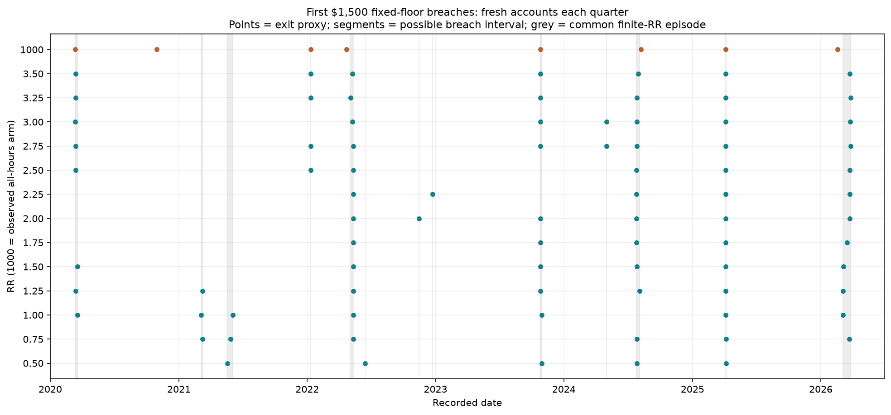
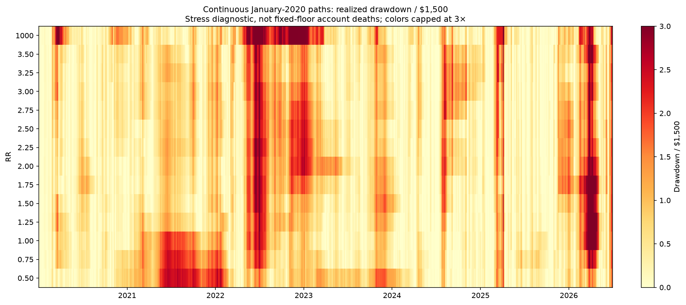

# Do RR settings fail in different historical episodes?

**Yes, there is reciprocal historical failure-episode separation. RR0.50/2.50 has the lowest primary episode overlap among the 78 finite-RR pairs screened; RR0.50/2.25 is nearby. This remains an exploratory comparison, not a proven optimal mix.**

Primary test: 26 non-overlapping calendar quarters, January 2020–June 2026. Every period starts each account flat with $1,500 fixed headroom. No operating policies. Monthly and six-month partitions and $6,800 headroom are retained as sensitivities. These are historical counts, not independent future failure probabilities.

Only trades completed before a window ends contribute realized P&L and excursion breaches; boundary positions stay open and their full MAE is censored because its timing is unknown. This matters especially for the long-held RR1000 positions.

## RR1000 validation

- 5,430 trades reconcile with counts, gross profits/losses and tester realized drawdown.
- 1,246 exits occur at 23:30; the other 4,184 match the original stop loss. Exit reasons are inferred from clock and P&L, not an explicit reason field.
- Maximum exported MFE is 79.07R, below the 1000R target. No target hits are observed.
- 73 positions cross dates; maximum holding time is 20.43 days. This is the observed tape, not proof of an unconditional daily-flat rule.
- 1,108 entries are absent from the RR1 source-window union; all 4,322 matched entries have identical stop ranges. The user confirms all hours were enabled together and other entry/stop settings were unchanged.
- RR1000 is a separate, already non-overlapping all-hours arm. Windows starting while its recorded position is open are excluded from fresh-flat comparisons; counterfactual signals are unavailable.

The longest hold runs from **2025-03-11 04:07:40 to 2025-03-31 14:29:20**. Other long holds include 2022-03-15 to 2022-03-28, 2023-03-13 to 2023-03-27, and 2024-03-15 to 2024-04-01. These dates make session-clock handling worth checking in the EA/tester, but the export alone does not establish the cause. The 73 cross-date trades contribute $15,148.50 of the $47,157.50 gross P&L; their behavior is material. They are retained, not silently dropped or altered.

## Concrete separation, beyond a few different exit dates

- May–June 2021 and October 2023: RR0.50 breaches, while RR2.50 survives each entire corresponding quarter.
- March 2020, January 2022 and March 2026: RR2.50 breaches, while RR0.50 survives each entire corresponding quarter.
- July–August 2024 and April 2025: both breach in the same common episode.
- May versus June 2022 is less decisive: both fail in the same quarter. A 20-date grouping separates their breaches, while 40 dates merges them. The other examples above do not depend on counting that May/June split as two episodes.

## Individual failures

| RR | Eligible quarters | Failed quarters | Excluded quarters |
|---|---:|---:|---:|
| 0.50 | 26 | 5 | 0 |
| 0.75 | 26 | 6 | 0 |
| 1.00 | 26 | 7 | 0 |
| 1.25 | 26 | 7 | 0 |
| 1.50 | 26 | 6 | 0 |
| 1.75 | 26 | 5 | 0 |
| 2.00 | 26 | 6 | 0 |
| 2.25 | 26 | 5 | 0 |
| 2.50 | 26 | 6 | 0 |
| 2.75 | 26 | 8 | 0 |
| 3.00 | 26 | 7 | 0 |
| 3.25 | 26 | 7 | 0 |
| 3.50 | 26 | 7 | 0 |
| 1000 | 24 | 8 | 2 |

At $6,800 headroom there are no observed eligible-window breaches in any of the three partitions, including the observed RR1000 arm. That control cannot rank episode overlap.

RR1000 fails in 8/24 eligible quarters. Every one of RR2.50's six failed quarters on those dates also fails under RR1000; RR1000 adds two more. At this threshold and horizon it provides no reciprocal failed-quarter protection against RR2.50. The daily-close implementation qualification remains separate from this observed result.

## Same quarter versus different quarters

The four columns below partition eligible quarters. Both failing in one quarter does not imply one-day synchronization; the dated episode comparison follows.

| Pair | Eligible | Both fail | Only left | Only right | Neither |
|---|---:|---:|---:|---:|---:|
| 0.50 / 2.50 | 26 | 3 | 2 | 3 | 18 |
| 0.50 / 2.25 | 26 | 3 | 2 | 2 | 19 |
| 1.00 / 2.25 | 26 | 3 | 4 | 2 | 17 |
| 1.00 / 1.75 | 26 | 4 | 3 | 1 | 18 |
| 0.50 / 1.75 | 26 | 4 | 1 | 1 | 20 |
| 0.50 / 3.50 | 26 | 4 | 1 | 3 | 18 |
| 0.50 / 1000 | 24 | 4 | 1 | 4 | 15 |
| 0.75 / 1000 | 24 | 4 | 2 | 4 | 14 |
| 1.00 / 1000 | 24 | 5 | 2 | 3 | 14 |
| 1.75 / 1000 | 24 | 5 | 0 | 3 | 16 |
| 2.25 / 1000 | 24 | 4 | 1 | 4 | 15 |
| 2.50 / 1000 | 24 | 6 | 0 | 2 | 16 |

## Common dated episodes

Pool first-breach intervals across all 13 finite RRs, then merge intervals separated by no more than 20 observed trading dates. Transitive merging can join a prolonged stress period. Boundaries are common to every pair, and RR1000 cannot move them. These are loss episodes in this strategy history, not independently identified macroeconomic regimes.

| Episode | First possible breach | Last possible breach | RRs failing |
|---|---|---|---|
| 3m_b1500_g20_e01 | 2020-03-12 | 2020-03-18 | 1.00/1.25/1.50/2.50/2.75/3.00/3.25/3.50 |
| 3m_b1500_g20_e02 | 2021-03-04 | 2021-03-08 | 0.75/1.00/1.25 |
| 3m_b1500_g20_e03 | 2021-05-18 | 2021-06-03 | 0.50/0.75/1.00 |
| 3m_b1500_g20_e04 | 2022-01-10 | 2022-01-10 | 2.50/2.75/3.25/3.50 |
| 3m_b1500_g20_e05 | 2022-05-03 | 2022-05-12 | 0.75/1.00/1.25/1.50/1.75/2.00/2.25/2.50/2.75/3.00/3.25/3.50 |
| 3m_b1500_g20_e06 | 2022-06-14 | 2022-06-14 | 0.50 |
| 3m_b1500_g20_e07 | 2022-11-14 | 2022-11-14 | 2.00 |
| 3m_b1500_g20_e08 | 2022-12-23 | 2022-12-23 | 2.25 |
| 3m_b1500_g20_e09 | 2023-10-25 | 2023-10-30 | 0.50/1.00/1.25/1.50/1.75/2.00/2.75/3.00/3.25/3.50 |
| 3m_b1500_g20_e10 | 2024-05-01 | 2024-05-01 | 2.75/3.00 |
| 3m_b1500_g20_e11 | 2024-07-25 | 2024-08-02 | 0.50/0.75/1.25/1.50/1.75/2.00/2.25/2.50/2.75/3.00/3.25/3.50 |
| 3m_b1500_g20_e12 | 2025-04-04 | 2025-04-07 | 0.50/0.75/1.00/1.25/1.50/1.75/2.00/2.25/2.50/2.75/3.00/3.25/3.50 |
| 3m_b1500_g20_e13 | 2026-03-05 | 2026-03-26 | 0.75/1.00/1.25/1.50/1.75/2.00/2.25/2.50/2.75/3.00/3.25/3.50 |

| Pair | Shared episodes | Only left | Only right | Reciprocal unique episodes? |
|---|---:|---:|---:|---|
| 0.50 / 2.50 | 2 | 3 | 4 | True |
| 0.50 / 2.25 | 2 | 3 | 3 | True |
| 1.00 / 2.25 | 3 | 4 | 2 | True |
| 1.00 / 1.75 | 4 | 3 | 1 | True |
| 0.50 / 1.75 | 3 | 2 | 2 | True |
| 0.50 / 3.50 | 3 | 2 | 4 | True |

## Boundary and grouping sensitivity

Each cell is shared / left-only / right-only episode counts. A pair with zero unique episodes on one side does not demonstrate reciprocal episode diversification.

| Pair | Window months | Gap 5 | Gap 20 | Gap 40 |
|---|---:|---|---|---|
| 0.50 / 2.50 | 1 | 5 / 3 / 7 | 5 / 2 / 4 | 5 / 2 / 2 |
| 0.50 / 2.50 | 3 | 2 / 3 / 4 | 2 / 3 / 4 | 3 / 2 / 3 |
| 0.50 / 2.50 | 6 | 1 / 2 / 3 | 1 / 2 / 3 | 1 / 2 / 3 |
| 0.50 / 2.25 | 1 | 5 / 3 / 6 | 5 / 2 / 3 | 5 / 2 / 2 |
| 0.50 / 2.25 | 3 | 2 / 3 / 3 | 2 / 3 / 3 | 3 / 2 / 2 |
| 0.50 / 2.25 | 6 | 1 / 2 / 2 | 1 / 2 / 2 | 1 / 2 / 2 |
| 1.00 / 2.25 | 1 | 6 / 2 / 5 | 3 / 2 / 5 | 3 / 2 / 4 |
| 1.00 / 2.25 | 3 | 3 / 4 / 2 | 3 / 4 / 2 | 3 / 4 / 2 |
| 1.00 / 2.25 | 6 | 1 / 2 / 2 | 1 / 2 / 2 | 1 / 2 / 2 |
| 1.00 / 1.75 | 1 | 7 / 1 / 6 | 4 / 1 / 6 | 4 / 1 / 5 |
| 1.00 / 1.75 | 3 | 4 / 3 / 1 | 4 / 3 / 1 | 4 / 3 / 1 |
| 1.00 / 1.75 | 6 | 1 / 2 / 1 | 1 / 2 / 1 | 1 / 2 / 1 |
| 0.50 / 1.75 | 1 | 6 / 2 / 7 | 6 / 1 / 4 | 6 / 1 / 3 |
| 0.50 / 1.75 | 3 | 3 / 2 / 2 | 3 / 2 / 2 | 4 / 1 / 1 |
| 0.50 / 1.75 | 6 | 1 / 2 / 1 | 1 / 2 / 1 | 1 / 2 / 1 |
| 0.50 / 3.50 | 1 | 6 / 2 / 7 | 6 / 1 / 3 | 6 / 1 / 1 |
| 0.50 / 3.50 | 3 | 3 / 2 / 4 | 3 / 2 / 4 | 4 / 1 / 3 |
| 0.50 / 3.50 | 6 | 2 / 1 / 4 | 2 / 1 / 4 | 2 / 1 / 4 |

## Chronology

The second chart marks continuous realized drawdown of at least $1,500 from the earned peak. It shows recurring stress, not account deaths. Continuous deep-drawdown overlap is saved in pair_windows.csv as a supplementary diagnostic.

## Evidence and verification

- windows.csv and breach_events.csv retain eligibility, first-breach intervals and trade identities.
- episodes.csv and episode_membership.csv retain every episode boundary and all contributing events.
- pair_windows.csv and pair_episodes.csv retain all pairs and sensitivity combinations.
- native_trades.csv and selected_trades.json retain reproducible source and selection evidence.
- Cross-date positions and unmatched RR1000 entries are exported separately; no source files were altered.
- Checks: {"decimal_first_marker_matches": 3276, "full_router_matches": 14, "pair_partition_checks": 546, "quarter_router_matches": 364, "source_full_curve_and_selection_matches": 13}.
- Input, code and output hashes are recorded in manifest.json. Original finite-RR paths and selections reproduce the frozen study; first breaches are checked with separate Decimal accounting.

- [Independent audit](independent_audit.json) reconstructs episode groups as connected components of an interval graph and checks all failed-window and episode-pair set counts.

Reproduce with `.\venv\Scripts\python.exe scripts/study_rr_episodes.py`, followed by `.\venv\Scripts\python.exe scripts/audit_rr_episodes.py`.
