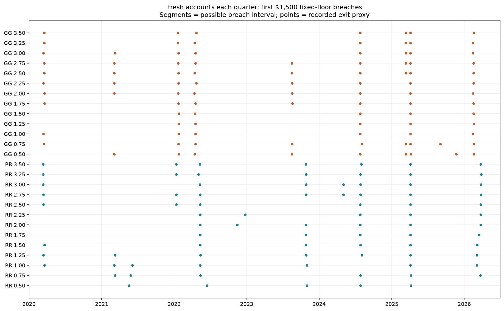
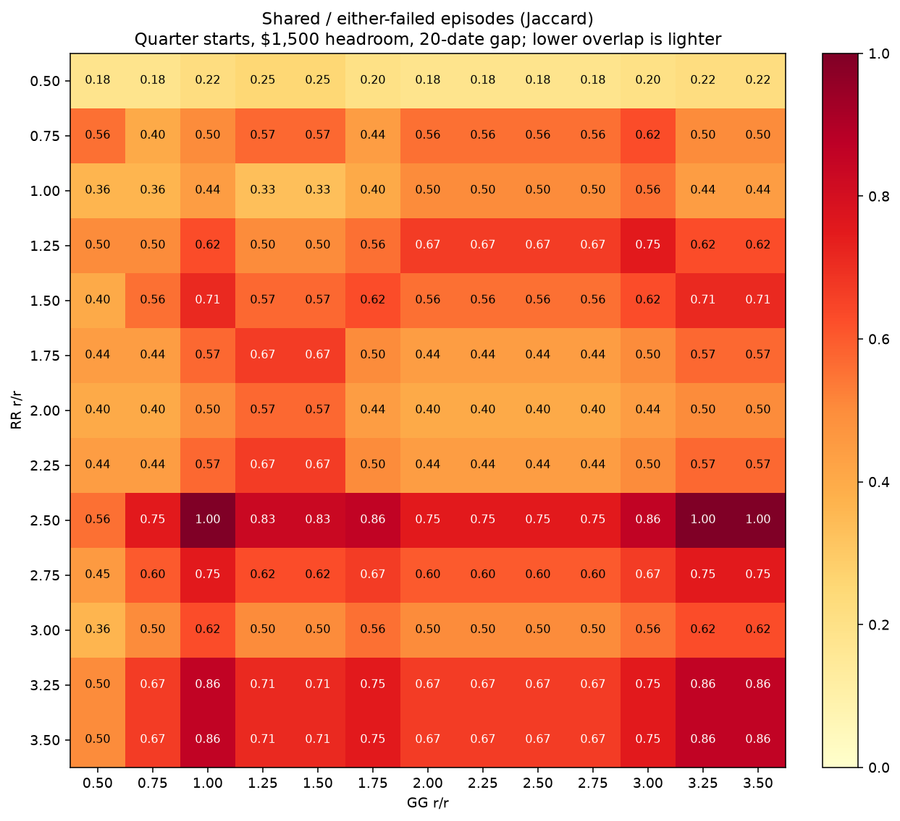

# RR–GG cross-strategy failure episodes

RR and GG name strategies; numeric suffixes give r/r. Exploratory coarse screen: 13 settings per strategy, 169 cross-strategy pairs, 26 homogeneous controls, and RR:0.50/RR:2.50 as a within-RR benchmark. No RR1000 arm.

Accounts start together with one MNQ and $1,500 fixed headroom. Primary evidence uses 26 non-overlapping quarters from January 2020 through June 2026. No withdrawals, replacements, pooling or cap. $1.05 commission per completed trade. Monthly and six-month starts, $6,800 headroom and 5/20/40-date episode gaps are retained.

## Lowest observed episode overlaps

Sorted by primary episode Jaccard overlap, then both-failed quarter count and arm name. This is in-sample ranking; adjacent settings and sensitivities matter more than a precise winner. An episode groups first-breach intervals separated by at most 20 observed dates, transitively, across all 26 arms. These are strategy-loss episodes, not macroeconomic regimes. Adding GG can change common episode boundaries; the RR benchmark uses those same boundaries.

| RR arm | Other arm | Shared episodes | RR-only episodes | Other-only episodes | Both-failed quarters | Mean quarter P&L | Mean quarter DD |
|---|---|---:|---:|---:|---:|---:|---:|
| RR:0.50 | GG:0.50 | 2 | 3 | 6 | 3/26 | $748 | $1,559 |
| RR:0.50 | GG:0.75 | 2 | 3 | 6 | 3/26 | $886 | $1,551 |
| RR:0.50 | GG:2.00 | 2 | 3 | 6 | 3/26 | $1,050 | $1,654 |
| RR:0.50 | GG:2.25 | 2 | 3 | 6 | 3/26 | $1,043 | $1,671 |
| RR:0.50 | GG:2.50 | 2 | 3 | 6 | 3/26 | $1,021 | $1,719 |
| RR:0.50 | GG:2.75 | 2 | 3 | 6 | 3/26 | $1,049 | $1,724 |
| RR:0.50 | GG:1.75 | 2 | 3 | 5 | 3/26 | $987 | $1,677 |
| RR:0.50 | GG:3.00 | 2 | 3 | 5 | 3/26 | $1,105 | $1,710 |
| RR:0.50 | RR:2.50 | 2 | 3 | 4 | 3/26 | $1,181 | $1,660 |

Pair curves are equal-weight averages, not sums. Separate accounts still fail individually. Dollar figures are descriptive means, not forecasts. One-MNQ sizing does not equalize actual trade count, stop distance or holding time.

## Homogeneous controls

| Strategy / r/r | Failed quarters | Full-history net P&L | Full-history realized max DD |
|---|---:|---:|---:|
| RR:0.50 | 5/26 | $22,564 | $4,324 |
| RR:0.75 | 6/26 | $22,040 | $4,777 |
| RR:1.00 | 7/26 | $27,151 | $6,379 |
| RR:1.25 | 7/26 | $29,498 | $6,359 |
| RR:1.50 | 6/26 | $33,666 | $6,535 |
| RR:1.75 | 5/26 | $35,749 | $7,234 |
| RR:2.00 | 6/26 | $34,529 | $5,810 |
| RR:2.25 | 5/26 | $36,013 | $5,287 |
| RR:2.50 | 6/26 | $38,946 | $5,140 |
| RR:2.75 | 8/26 | $37,256 | $5,257 |
| RR:3.00 | 7/26 | $37,136 | $5,514 |
| RR:3.25 | 7/26 | $39,747 | $5,047 |
| RR:3.50 | 7/26 | $38,132 | $6,180 |
| GG:0.50 | 9/26 | $16,673 | $6,308 |
| GG:0.75 | 9/26 | $23,810 | $5,370 |
| GG:1.00 | 6/26 | $30,172 | $6,262 |
| GG:1.25 | 5/26 | $34,036 | $6,272 |
| GG:1.50 | 5/26 | $33,496 | $5,970 |
| GG:1.75 | 7/26 | $28,945 | $6,297 |
| GG:2.00 | 8/26 | $32,202 | $5,788 |
| GG:2.25 | 8/26 | $32,048 | $6,163 |
| GG:2.50 | 9/26 | $31,019 | $7,356 |
| GG:2.75 | 9/26 | $32,476 | $6,949 |
| GG:3.00 | 8/26 | $35,364 | $6,338 |
| GG:3.25 | 7/26 | $31,808 | $8,134 |
| GG:3.50 | 7/26 | $38,503 | $7,825 |

## Candidate sensitivity

Cells are shared / RR-only / other-only episodes. Both exclusive counts must be positive for observed reciprocal protection. Different counts with different reset horizons are expected; these periods are not independent observations.

| Pair | Window months | Gap 5 | Gap 20 | Gap 40 |
|---|---:|---|---|---|
| RR:0.50 / GG:0.50 | 1 | 5 / 3 / 11 | 5 / 2 / 4 | 6 / 1 / 3 |
| RR:0.50 / GG:0.50 | 3 | 2 / 3 / 7 | 2 / 3 / 6 | 3 / 2 / 5 |
| RR:0.50 / GG:0.50 | 6 | 1 / 2 / 6 | 1 / 2 / 6 | 1 / 2 / 6 |
| RR:0.50 / GG:0.75 | 1 | 4 / 4 / 11 | 5 / 2 / 4 | 5 / 2 / 4 |
| RR:0.50 / GG:0.75 | 3 | 2 / 3 / 7 | 2 / 3 / 6 | 3 / 2 / 5 |
| RR:0.50 / GG:0.75 | 6 | 1 / 2 / 6 | 1 / 2 / 6 | 1 / 2 / 6 |
| RR:0.50 / GG:2.00 | 1 | 5 / 3 / 10 | 5 / 2 / 4 | 5 / 2 / 4 |
| RR:0.50 / GG:2.00 | 3 | 2 / 3 / 6 | 2 / 3 / 6 | 3 / 2 / 5 |
| RR:0.50 / GG:2.00 | 6 | 1 / 2 / 6 | 1 / 2 / 6 | 1 / 2 / 6 |
| RR:0.50 / RR:2.50 | 1 | 5 / 3 / 7 | 5 / 2 / 2 | 5 / 2 / 2 |
| RR:0.50 / RR:2.50 | 3 | 2 / 3 / 4 | 2 / 3 / 4 | 3 / 2 / 3 |
| RR:0.50 / RR:2.50 | 6 | 1 / 2 / 3 | 1 / 2 / 3 | 1 / 2 / 3 |

## $6,800 fixed-headroom control

No observed breaches in any arm/partition.

## Chronology and the full cross-strategy grid

## Limits and evidence

- Unclosed boundary positions are uncredited and their full MAE is censored. Exact intratrade breach times are unknown; first-breach entry-to-exit intervals are preserved.
- Shared episodes can be long because grouping is transitive. All boundaries and contributing failures are in episodes.csv and episode_membership.csv.
- A mix can look different because one constituent rarely fails or loses money at other times. Homogeneous controls and period P&L remain visible.
- Earlier/later failures, all pairs, and sensitivity results are retained in pair_windows.csv, pair_episodes.csv, quarter_curves.csv and screen.csv.
- GG replacement validation and backup history are in ../rr_gg_input_update/input_update.json.
- Runner checks: {"decimal_first_markers": 6084, "pair_curve_accounting": 4420, "prior_rr_marker_matches": 3042, "quarter_router_sequences": 676}.
- [Independent audit](independent_audit.json) checks input/output hashes, period sets and graph reconstruction of episode groups.

Reproduce: `.\venv\Scripts\python.exe scripts/study_rr_gg_episodes.py`, then `.\venv\Scripts\python.exe scripts/audit_rr_gg_episodes.py`.
