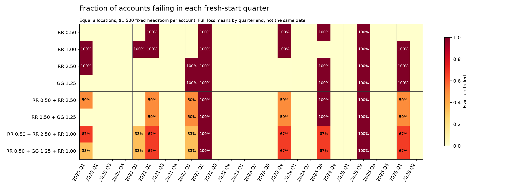
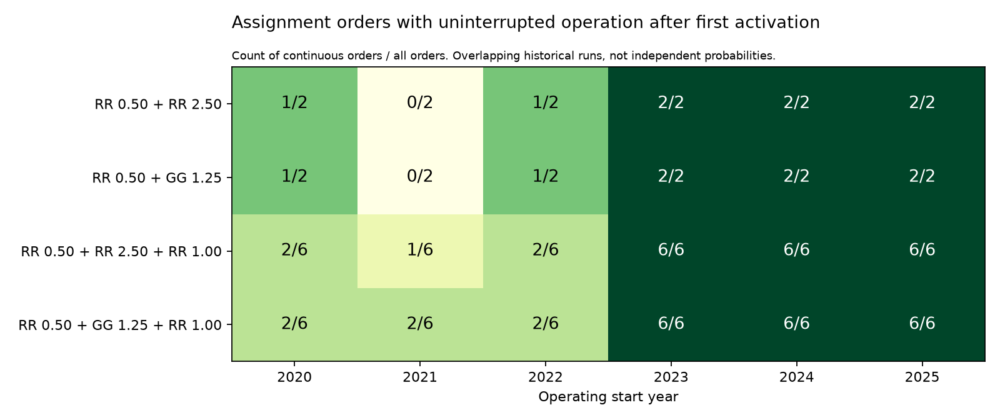

# Fixed RR/GG shortlist: a third component helps one failure period, with costs

The equal-weight triples reduce complete-loss quarters from **3/26 to 2/26**,
but lose a larger fraction of accounts on average and increase the worst
quarterly drawdown. Under the inherited operating policy, neither triple
establishes a clear improvement in continuity over its pair. **RR 0.50 /
RR 2.50 remains a useful operating benchmark; the triples are tradeoffs,
not demonstrated upgrades.**

The fixed shortlist contains two pairs, the same pairs with RR 1.00 added,
and all four individual settings as homogeneous controls. No settings or
weights were tuned after observing this comparison. RR and GG are strategies;
the numbers are r/r settings. All results use already examined history.

## 1. All 26 fresh-start quarters

Each account starts flat with $1,500 above a fixed floor, one MNQ and $1.05
commission. Equal allocations are compared as fractions; adding a component
does not add capital. No withdrawals, replacements or deployment effects.

| Equal-weight mixture | Full loss / 26 | Mean fraction of accounts lost | Mean quarter P&L | Mean quarter DD | Worst quarter DD |
|---|---:|---:|---:|---:|---:|
| RR 0.50 + RR 2.50 | 3 | 21.15% | $1,181 | $1,660 | $4,036 |
| RR 0.50 + GG 1.25 | 3 | 19.23% | $1,082 | $1,565 | $4,175 |
| RR 0.50 + RR 2.50 + RR 1.00 | 2 | 23.08% | $1,135 | $1,670 | $4,817 |
| RR 0.50 + GG 1.25 + RR 1.00 | 2 | 21.79% | $1,070 | $1,554 | $4,909 |

RR 1.00 protects the triples in **Q3 2024**, leaving one-third of the
allocation alive. Both triples still lose every group in **Q2 2022 and
Q2 2025**. Both pairs have those three shared failure quarters. No crises
were excluded from these averages or the conclusions.

The cost is visible elsewhere: adding RR 1.00 creates a loss in Q1 2021,
increases the fraction lost in several other quarters, and reduces the number
of entirely loss-free quarters. The RR pair has 18 loss-free quarters; the
RR/GG pair has 19; each triple has 17. The worst-quarter loss fraction is
100% for every portfolio.

The individual controls fail in 5/26 quarters for RR 0.50, 7/26 for RR 1.00,
6/26 for RR 2.50 and 5/26 for GG 1.25. Mixtures reduce complete losses versus
these homogeneous books, but do not automatically reduce individual losses.

The P&L curves continue analytically after failure. They are useful for
comparing return paths, but are not cash earned by dead accounts. Drawdown
uses daily realized P&L, not exact combined open equity. Equal one-contract
capacity does not equalize stop distances, holding time or trade count.

The continuous January-2020-to-June-2026 diagnostic also cautions against
equating a lower mean quarterly DD with a universally smoother path:

| Mixture | Continuous normalized P&L | Continuous realized maximum DD |
|---|---:|---:|
| RR pair | $30,755 | $4,036 |
| RR/GG pair | $28,300 | $4,773 |
| RR triple | $29,553 | $4,817 |
| RR/GG triple | $27,917 | $4,909 |

## 2. Restore the existing operating setup

The operating test uses daily minimum withdrawals, a $6,800 reserve above
the frozen floor, $5,000 initial purchasing cash plus $200/month, RR 1.00
evaluations and the inherited replacement policy. The 20-slot cap includes
live PAs, spares and reserved evaluation seats. Each PA retains its assigned
strategy/r/r for life. New accounts fill the least populated live group;
assignment order breaks ties. Targets are equal, but actual group sizes vary.

All two orders for each pair and all six orders for each triple were tested
over 2020–2025 starts, plus the homogeneous controls: **120 cases**. The
operating horizon runs through July 13, 2026, matching the existing operating
studies; the incomplete July quarter is excluded from isolation.

| Mixture | Continuous cases | Starts continuous in every order / 6 | Mean wipeouts | Mean empty days | Mean deaths | Mean net cash | Mean retained equity |
|---|---:|---:|---:|---:|---:|---:|---:|
| RR pair | 8/12 | 3 | 0.417 | 6.94 | 34.9 | $201,332 | $138,183 |
| RR/GG pair | 8/12 | 3 | 0.583 | 14.36 | 38.2 | $162,052 | $119,076 |
| RR triple | 23/36 | 3 | 0.694 | 7.17 | 32.4 | $206,283 | $129,909 |
| RR/GG triple | 24/36 | 3 | 0.556 | 11.90 | 36.7 | $178,061 | $116,966 |

Means equally weight the six starts and all orders within each start. A
continuous case must activate accounts and never empty afterward. These
overlapping historical runs are not independent trials or estimated future
success probabilities. Cash is receipts less acquisition costs; retained
equity is separate and is not assumed immediately withdrawable.

All four mixtures are continuous in every order for the **2023, 2024 and
2025 starts**. Earlier starts remain order-sensitive. For example, the
2022 RR pair ranges from zero empty time to **55.51 days**, depending only
on assignment order. Taking the most favorable order would conceal this.

For the RR pair, adding RR 1.00 raises average wipeouts and slightly raises
empty time, while lowering deaths and raising cash modestly. Retained equity
falls. For the RR/GG pair, adding RR 1.00 lowers mean empty time and deaths
and raises cash, but leaves the fraction of continuous cases unchanged at
two-thirds and does not improve the number of starts continuous in every
order. Neither is a clear continuity upgrade.

The RR pair has the lowest average wipeout count and empty time among the
four mixtures. RR 2.50 alone earns more average net cash ($243,290), but has
2.0 mean wipeouts versus 0.417 for the RR pair. No single score captures
these competing outcomes.

All observed mixture empty-book intervals begin in 2020–2022; the final
death event removes only one to three remaining accounts. These are losses
of the last surviving accounts, not synchronized destruction of a fully
populated 20-account book. This reinforces the distinction between preserving
an established portfolio and successfully building one.

## What this establishes

We have measured a limited diversification benefit and its cost. The triples
cover Q3 2024 under equal fresh starting headroom, but do not eliminate the
two common failure quarters. Their isolation advantage does not translate
into a robust improvement in continuity under the inherited operating rules.

Keep the RR pair as the operating reference and the RR/GG pair as an
alternative with fewer individual failures in the fixed-floor quarterly
experiment. The evidence does not justify declaring a triple superior or
choosing an optimal live allocation. Policies and funding materially change
the comparison, and newly arriving data would be needed for an independent
forward check of the now-fixed shortlist.

## Verification and artifacts

- 104 component selections and first breaches match the blocked router,
  independent Decimal accounting and the prior episode results.
- 156 existing pair/homogeneous curves reproduce; 208 weighted portfolio
  quarters pass P&L and drawdown checks.
- All 18 prior homogeneous RR operating account ledgers and economics
  reproduce exactly. Over 8.34 million account/trade copies were checked for
  correct strategy assignment and non-overlapping positions.
- All 120 operating cases pass reserve, cash and shared-capacity checks.
  A separate audit reconstructs continuity from the union of account
  lifetimes and replays group assignment without the router implementation.
- Input, code and result hashes are preserved; the shared engine and earlier
  sealed studies were not changed.

[Frozen design](../../../research/legacy_25k/RR_GG_SHORTLIST.md) ·
[Generated report, including all controls](REPORT.generated.md) ·
[Quarter outcomes](isolation_quarters.csv) ·
[Operating cases](operating_comparison.csv) ·
[Every start's order range](operating_by_start.csv) ·
[Primary audit](audit.json) · [Independent reconstruction](verification/audit.json)
