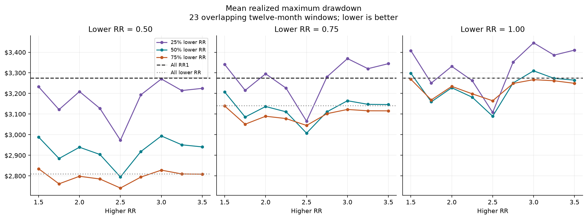
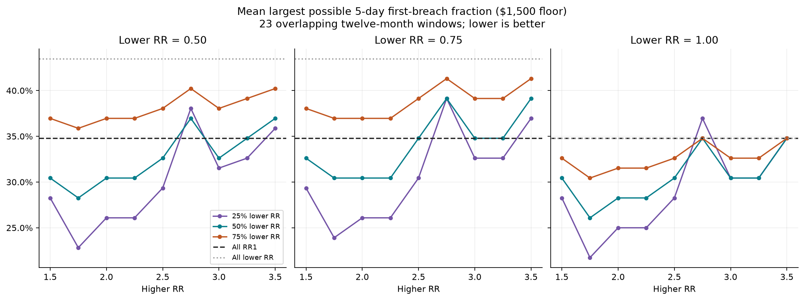

# Lower/higher RR pairs: allocation sensitivity

**Curve smoothing and account survival favor different allocations.** RR2.50 minimizes mean drawdown in each of the nine lower-RR/allocation groups. More RR0.50 exposure can reduce curve drawdown while increasing account losses. The lowest five-day failure concentration among mixtures instead uses RR1.00/1.75 at 25/75, and is still worse than RR1.75 alone.

81 mixtures and 13 homogeneous controls reuse the audited synchronized paths. No operating policies or MT5 session-close data are added. Primary comparisons use the same 23 overlapping twelve-month windows; six full-history cohorts are saved separately.

Weights are seat fractions at unchanged one-MNQ sizing and unchanged per-account headroom. Dollar curves are weighted averages at one-MNQ-equivalent exposure. Changing allocation does not change the constituent failure dates or the windows where both fail.

## Allocation and RR sensitivity

Each row below is the lowest mean realized maximum drawdown within its lower-RR/allocation group, selected on the same historical data. It is a descriptive screen, not an independently validated recommendation. All 81 combinations are retained in summary.csv.

| Lower RR | Higher RR selected | Lower allocation | Mean P&L | Mean max DD | DD wins vs RR1 | Later DD wins | Beats both constituents | All fail | Mean fraction failed | Possible 5-day cluster |
|---|---|---:|---:|---:|---:|---:|---:|---:|---:|---:|
| 0.50 | 2.50 | 25% | $5,116 | $2,973 | 15/23 | 5/11 | 5/23 | 3/23 | 30.4% | 29.3% |
| 0.50 | 2.50 | 50% | $4,412 | $2,795 | 15/23 | 5/11 | 5/23 | 3/23 | 34.8% | 32.6% |
| 0.50 | 2.50 | 75% | $3,708 | $2,741 | 14/23 | 5/11 | 4/23 | 3/23 | 39.1% | 38.0% |
| 0.75 | 2.50 | 25% | $5,192 | $3,066 | 11/23 | 5/11 | 3/23 | 4/23 | 30.4% | 30.4% |
| 0.75 | 2.50 | 50% | $4,565 | $3,007 | 15/23 | 5/11 | 2/23 | 4/23 | 34.8% | 34.8% |
| 0.75 | 2.50 | 75% | $3,938 | $3,045 | 11/23 | 2/11 | 1/23 | 4/23 | 39.1% | 39.1% |
| 1.00 | 2.50 | 25% | $5,411 | $3,108 | 10/23 | 5/11 | 6/23 | 3/23 | 28.3% | 28.3% |
| 1.00 | 2.50 | 50% | $5,003 | $3,090 | 15/23 | 5/11 | 9/23 | 3/23 | 30.4% | 30.4% |
| 1.00 | 2.50 | 75% | $4,595 | $3,165 | 15/23 | 5/11 | 5/23 | 3/23 | 32.6% | 32.6% |

Failure columns use the $1,500 excursion-based fixed floor. "All fail" means both constituents breach sometime in the window, not necessarily together. Five-day clusters conservatively use entry-to-exit breach intervals. All means include zero-failure windows.

## Homogeneous controls

| RR | Mean P&L | Mean max DD | Failure windows | Mean fraction failed / possible 5-day cluster |
|---|---:|---:|---:|---:|
| 0.50 | $3,004 | $2,810 | 10/23 | 43.5% |
| 0.75 | $3,311 | $3,141 | 10/23 | 43.5% |
| 1.00 | $4,187 | $3,274 | 8/23 | 34.8% |
| 1.25 | $4,637 | $3,306 | 7/23 | 30.4% |
| 1.50 | $5,174 | $3,535 | 6/23 | 26.1% |
| 1.75 | $5,510 | $3,415 | 4/23 | 17.4% |
| 2.00 | $5,206 | $3,502 | 5/23 | 21.7% |
| 2.25 | $5,414 | $3,399 | 5/23 | 21.7% |
| 2.50 | $5,819 | $3,186 | 6/23 | 26.1% |
| 2.75 | $5,423 | $3,552 | 9/23 | 39.1% |
| 3.00 | $5,409 | $3,614 | 7/23 | 30.4% |
| 3.25 | $5,773 | $3,551 | 7/23 | 30.4% |
| 3.50 | $5,502 | $3,598 | 8/23 | 34.8% |

## Failure concentration is a separate outcome

These are the three lowest five-day cluster means among tested mixtures, shown with their homogeneous RR1.75 control. Selecting by this metric does not select the same pair as selecting by curve drawdown.

| Portfolio | Lower allocation | Mean max DD | Mean P&L | All fail | Mean fraction failed | Possible 5-day cluster |
|---|---:|---:|---:|---:|---:|---:|
| RR1.75 alone | - | $3,415 | $5,510 | 4/23 | 17.4% | 17.4% |
| 1.00/1.75 | 25% | $3,251 | $5,179 | 3/23 | 21.7% | 21.7% |
| 0.50/1.75 | 25% | $3,122 | $4,884 | 4/23 | 23.9% | 22.8% |
| 0.75/1.75 | 25% | $3,215 | $4,960 | 3/23 | 23.9% | 23.9% |

RR1.75 alone has fewer lost accounts and a smaller average cluster, but RR1.00/1.75 and RR0.75/1.75 have fewer windows with complete loss (3/23 versus 4/23). These are different objectives. Reweighting a given pair does not alter its complete-loss windows, because it does not alter individual account paths.

The fewest complete-loss windows among these pairs is **2/23 for RR1.00/2.25**, at all three allocations. Its 50/50 curve has mean drawdown $3,182 and mean P&L $4,801, with 28.3% mean account losses. It beats RR1 drawdown in only 8/23 windows (2/11 later windows). RR2.25 alone has 5/23 complete-loss windows but only 21.7% mean losses. The pair therefore preserves some accounts through more windows while losing a larger fraction of accounts on average than that constituent.

For RR0.50/2.50, moving from 50% to 75% in the lower RR reduces mean drawdown by only about $54, lowers mean P&L by about $704, and raises the mean fraction lost from 34.8% to 39.1%. Its 3/23 complete-loss count is unchanged. The smallest average curve drawdown is therefore not evidence of the best protection for accounts.

## Equal-weight neighborhood

Every row reproduces the earlier 50/50 screen exactly within numerical tolerance.

| Lower / higher RR | Mean P&L | Mean max DD | Earlier / later DD wins | All fail | Mean fraction failed | Possible 5-day cluster |
|---|---:|---:|---:|---:|---:|---:|
| 0.50 / 1.50 | $4,089 | $2,989 | 10/12; 2/11 | 5/23 | 34.8% | 30.4% |
| 0.50 / 1.75 | $4,257 | $2,884 | 10/12; 5/11 | 4/23 | 30.4% | 28.3% |
| 0.50 / 2.00 | $4,105 | $2,939 | 9/12; 2/11 | 4/23 | 32.6% | 30.4% |
| 0.50 / 2.25 | $4,209 | $2,904 | 9/12; 5/11 | 3/23 | 32.6% | 30.4% |
| 0.50 / 2.50 | $4,412 | $2,795 | 10/12; 5/11 | 3/23 | 34.8% | 32.6% |
| 0.50 / 2.75 | $4,214 | $2,918 | 9/12; 5/11 | 5/23 | 41.3% | 37.0% |
| 0.50 / 3.00 | $4,206 | $2,994 | 9/12; 2/11 | 5/23 | 37.0% | 32.6% |
| 0.50 / 3.25 | $4,388 | $2,951 | 10/12; 2/11 | 4/23 | 37.0% | 34.8% |
| 0.50 / 3.50 | $4,253 | $2,941 | 10/12; 2/11 | 5/23 | 39.1% | 37.0% |
| 0.75 / 1.50 | $4,243 | $3,207 | 6/12; 2/11 | 4/23 | 34.8% | 32.6% |
| 0.75 / 1.75 | $4,411 | $3,086 | 7/12; 5/11 | 3/23 | 30.4% | 30.4% |
| 0.75 / 2.00 | $4,259 | $3,137 | 9/12; 2/11 | 4/23 | 32.6% | 30.4% |
| 0.75 / 2.25 | $4,363 | $3,111 | 6/12; 2/11 | 4/23 | 32.6% | 30.4% |
| 0.75 / 2.50 | $4,565 | $3,007 | 10/12; 5/11 | 4/23 | 34.8% | 34.8% |
| 0.75 / 2.75 | $4,367 | $3,111 | 10/12; 5/11 | 5/23 | 41.3% | 39.1% |
| 0.75 / 3.00 | $4,360 | $3,165 | 9/12; 2/11 | 4/23 | 37.0% | 34.8% |
| 0.75 / 3.25 | $4,542 | $3,147 | 9/12; 2/11 | 3/23 | 37.0% | 34.8% |
| 0.75 / 3.50 | $4,407 | $3,146 | 10/12; 2/11 | 4/23 | 39.1% | 39.1% |
| 1.00 / 1.50 | $4,680 | $3,298 | 5/12; 2/11 | 4/23 | 30.4% | 30.4% |
| 1.00 / 1.75 | $4,849 | $3,159 | 6/12; 3/11 | 3/23 | 26.1% | 26.1% |
| 1.00 / 2.00 | $4,696 | $3,228 | 6/12; 2/11 | 3/23 | 28.3% | 28.3% |
| 1.00 / 2.25 | $4,801 | $3,182 | 6/12; 2/11 | 2/23 | 28.3% | 28.3% |
| 1.00 / 2.50 | $5,003 | $3,090 | 10/12; 5/11 | 3/23 | 30.4% | 30.4% |
| 1.00 / 2.75 | $4,805 | $3,251 | 7/12; 5/11 | 5/23 | 37.0% | 34.8% |
| 1.00 / 3.00 | $4,798 | $3,310 | 5/12; 2/11 | 5/23 | 32.6% | 30.4% |
| 1.00 / 3.25 | $4,980 | $3,273 | 10/12; 2/11 | 4/23 | 32.6% | 30.4% |
| 1.00 / 3.50 | $4,844 | $3,265 | 10/12; 2/11 | 4/23 | 34.8% | 34.8% |

## Visual comparison





## Interpretation limits

- More weight in an individually lower-loss RR can improve the average curve without creating additional temporal separation. Read the homogeneous controls and breach fractions together.
- The $6,800 fixed floor still has no observed breaches: reweighting cannot change that. Peak-drawdown markers are saved separately and are not account deaths.
- Earlier/later windows overlap and all history was already available. These are descriptive comparisons, not independent probabilities or out-of-sample forecasts.
- Curves are daily realized P&L. Exports do not reconstruct exact combined intratrade equity. Unclosed boundary positions and their MAE remain censored as in the source study.
- A future no-take-profit / session-close run requires native MT5 exports; finite-RR tapes cannot supply the counterfactual exits, stop-outs or missed entries.

## Verification

- 2,726 weighted curve reconstructions.
- 1,160 full curve-metric matches to prior controls and equal-weight pairs.
- 6,960 source failure-metric matches; 9,396 zero/full allocation endpoint matches.
- 16,356 weighted failure-fraction and all-failed invariants.
- 2,349 weighted $1,500 excursion-failure comparisons match a separate brute-force scan of duplicated whole-account seats.
- Source artifact hashes and frozen code verified; manifest.json pins this protocol, profile, script, source audit and every generated artifact.

Reproduce from the project root with Matplotlib installed:

```powershell
.\venv\Scripts\python.exe scripts/study_rr_pairs.py
```
